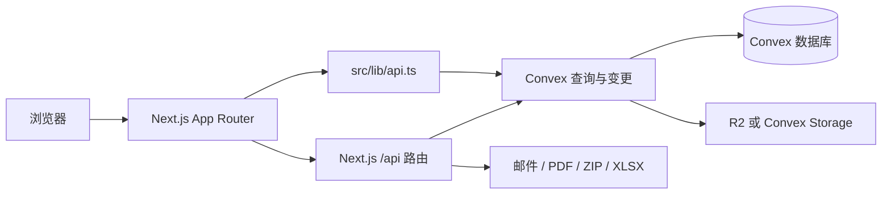

# 通班官网 · Tong Class

**北京大学与清华大学通用人工智能实验班的公开门户、成员内网与活动平台。**

线上地址：[tongclass.ac.cn](https://tongclass.ac.cn) · 公开仓库：[Cyber-TongClass/cyber-tongclass-public](https://github.com/Cyber-TongClass/cyber-tongclass-public)

项目以 Next.js App Router 为前端和服务端入口，以 Convex 提供数据库、实时查询、业务函数与文件存储。除公开官网外，仓库还包含课程评价、内部 OA、学术交流报销、独立 Reviewer 门户和 TechDay 子系统。

## 主要功能

- 公开官网：新闻、成员、学术成果、资源和项目介绍。
- 成员功能：课程评价、活动、个人资料、个人成果和通班内网。
- 内网工具：树洞、反馈、动态 OA 表单、报销申请与材料下载。
- TechDay：作者投稿、作品展示、评审推荐、奖项、志愿者报销和公告。
- 管理后台：成员、内容、课程评价、OA、报销、Reviewer 和 TechDay 管理。
- 服务端能力：邮件验证、Cloudflare Turnstile、PDF/ZIP/XLSX 导出，以及按业务策略使用 R2 或 Convex Storage 的文件上传。

## 环境要求

| 工具 | 最低版本 |
|---|---:|
| Node.js | 24.14.0 |
| npm | 11.9.0 |

本地开发还需要一个 Convex 开发部署。首次启动 `npx convex dev` 时，按提示选择 **LOGIN WITHOUT EMAIL**。

## 快速开始

```bash
git clone https://github.com/Cyber-TongClass/cyber-tongclass-public.git
cd cyber-tongclass-public
npm ci
```

分别在两个终端启动 Convex 和 Next.js：

```bash
npx convex dev
```

```bash
npm run dev
```

网站默认运行在 `http://localhost:3000`。Convex CLI 会维护本地开发部署以及 `NEXT_PUBLIC_CONVEX_URL` 配置。

## 配置

本地机密配置放在 `.env.local`，不要提交真实密钥。常用变量如下：

| 变量 | 用途 |
|---|---|
| `NEXT_PUBLIC_CONVEX_URL` | 浏览器和 Next.js 服务端连接 Convex |
| `NEXT_PUBLIC_SITE_URL` | 邮件链接使用的网站根地址 |
| `EMAIL_SIGNING_KEY` | 邮箱验证证明签名 |
| `SMTP_*` / `MAILTRAP_*` | 邮件发送 |
| `NEXT_PUBLIC_TURNSTILE_SITE_KEY` / `TURNSTILE_SECRET` | Turnstile 人机验证 |
| `R2_*` | Cloudflare R2 文件存储；先导课后台要求必须配置，其他旧业务可按各自策略回退到 Convex Storage |

完整说明见 [API 文档](documents/api.md) 和 [邮件配置](documents/email-auth-setup.md)。

## 架构



前端组件不得直接调用生成的 Convex API。统一使用 `src/lib/api.ts` 暴露的 Hook；服务端 Route Handler 使用 `src/lib/server/convex-http.ts`。

项目有三个相互独立的身份域：

- 主站成员会话：公开官网、课程、活动、个人中心和内网。
- TechDay 会话：外部作者、志愿者、评审以及与主站成员的身份映射。
- Reviewer 会话：使用 HttpOnly Cookie 的学术交流审核门户。

更详细的模块边界见 [模块说明](documents/module.md)。

## 项目结构

```text
src/app/             Next.js 页面、布局和 HTTP Route Handler
src/components/      共享 UI 与领域组件
src/lib/api.ts       前端访问 Convex 的统一入口
src/lib/server/      邮件、验证码、PDF、ZIP、XLSX 等服务端工具
src/styles/          Tailwind 全局样式与设计令牌
convex/              Schema、查询、变更和文件存储逻辑
public/              字体、模板、课程与内网公开静态资源
scripts/             手动迁移、校验和回归脚本
documents/           当前开发文档
docs/superpowers/    历史设计与实施方案
```

`convex/` 被视为已完成的后端边界。除非得到维护者明确授权，否则不要修改；组件也不要绕过 `src/lib/api.ts` 直接调用 Convex。

## 课程资料

ToNG 科研先导课的新资源通过 `/admin/resources/tong-init-course` 上传到私有 Cloudflare R2：管理员先上传草稿，确认后再原子发布，前台下载时才生成短时签名地址。替换、归档和恢复都不再要求提交或 push 资源文件。

`public/resources/tong-init-course/` 与 `src/lib/resources/tong-init-course.ts` 只保留 lec0–lec3 等历史静态资源作为兼容回退。首次启用后台时，管理员可执行一次幂等的“初始化现有资源”，把这些静态项登记进资源清单；不要再向该目录添加新课件。

## 开发检查

提交前至少运行：

```bash
npm run lint
npx tsc --noEmit --incremental false
npm run build
```

`npm run build` 会先执行 `npx convex codegen`，再生成 Next.js standalone 构建。当前仓库没有正式的单元测试或 E2E 测试套件；`scripts/test-*.mjs` 是针对特定回归场景的轻量脚本。

## 数据和迁移安全

- 安装依赖使用 `npm ci`，不要使用 `--force` 或 `--legacy-peer-deps`。
- 批量数据库写入必须可重复执行，并先按稳定标识检查现有记录。
- 迁移脚本必须手动运行，不能挂到 `dev`、`build` 或 `start` 生命周期。
- 未经明确确认，不要对生产 Convex 部署追加 `--prod`。
- 不要提交账号 CSV、恢复密码文件、`.env.local` 或其他包含个人信息的本地资料。

## 部署

- `.github/workflows/ci-cd.yml` 在 `main` 和 `develop` 上运行安装、lint、类型检查和构建。
- `Dockerfile` 使用 Next.js standalone 输出构建镜像，并通过 `/api/health` 健康检查。
- `main` 分支镜像推送至 GHCR 后，由部署任务更新生产服务。

## 维护者

- [Xiyao Tian](https://github.com/Prince-cjml)
- [Shaoheng Yan](https://github.com/PhotonYan)
- [Yinghan Chen](https://github.com/chenyinghan)
- [Jiangyue Zeng](https://github.com/qqqqingmo)

如需贡献，请基于公开仓库的最新 `main` 创建功能分支，并在 Pull Request 中说明验证命令和涉及的业务域。
